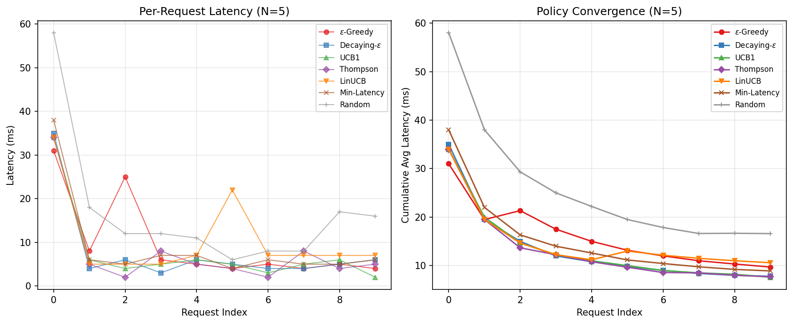
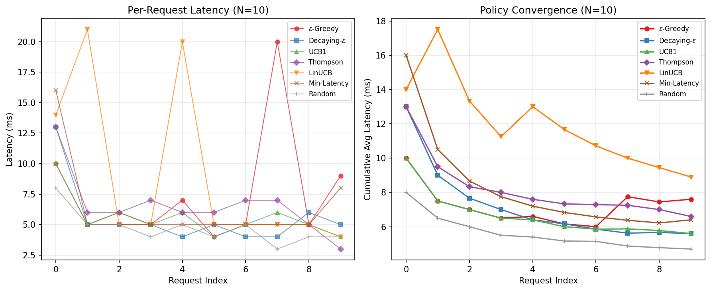
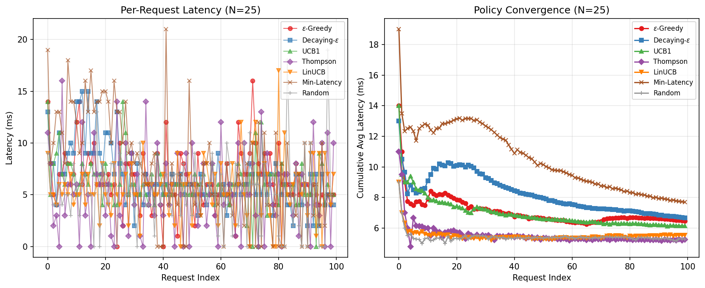
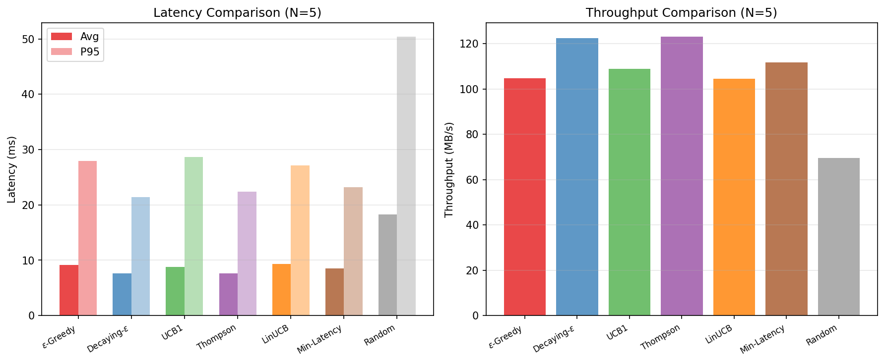
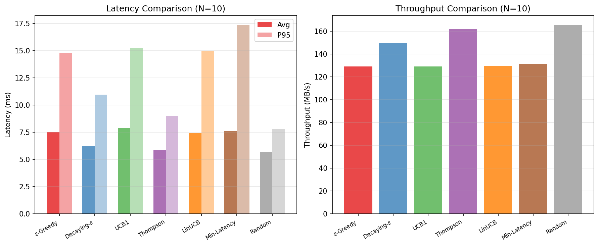
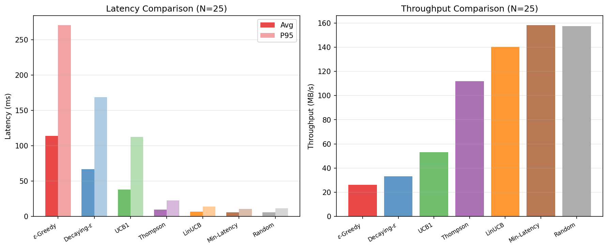

# pathaware-libp2p

A path-aware peer-to-peer content overlay built on [libp2p](https://libp2p.io), inspired by [SCION](https://scion-architecture.net)'s end-host path control. Combines path-quality probing, multi-armed bandit route selection, and Reed-Solomon erasure coding with content-addressed storage, NDN-style in-network caching, cooperative Bloom-filter cache exchange, and Ed25519-signed manifests.

> This is an experimental overlay prototype, not an implementation of the real SCION architecture. It borrows SCION's philosophy of end-host path control and applies it at the libp2p relay layer. There are no AS-level path segments, ISD isolation domains, or cryptographic path validation in the SCION sense.

## Problem

Standard libp2p treats all network paths equally. When multiple relay paths exist between two peers, libp2p picks one arbitrarily. This leads to suboptimal content delivery: high-latency paths get used when low-latency alternatives exist, and under load all peers pile onto the same "best" path (the herd effect), causing congestion collapse.

pathaware-libp2p adds path awareness to content delivery:

- Continuous probing of direct and relay paths with RTT, jitter, hop count, and success rate tracking
- Ten path selection policies including multi-armed bandit algorithms (UCB1, Thompson Sampling, contextual LinUCB) and epsilon-greedy exploration
- Path-aware provider ranking for content fetches
- Disjoint path selection for parallel fetching to avoid shared bottlenecks
- Multipath bandwidth aggregation via disjoint path racing
- NDN-style relay caching with cooperative Bloom filter exchange
- Popularity-aware cache eviction and proactive block replication
- Reed-Solomon erasure coding (k=4, m=2) for storage-efficient replication
- Adaptive chunking that tunes chunk size to network conditions

## Key Results

Benchmarked with 100 requests per run, 3 runs averaged, across 7 policies at N=5/10/25 nodes:

| Policy | N=5 Avg(ms) | N=25 Avg(ms) | N=25 P95(ms) | Throughput (MB/s) | Δ P95 |
|--------|-------------|--------------|--------------|-------------------|-------|
| Thompson | 5.09 ±0.15 | 5.89 | 11.35 | 160 | +22% |
| ε-greedy | 5.58 ±0.29 | 6.35 | 10.35 | 147 | **+3%** |
| Decaying-ε | 5.33 ±0.42 | 6.69 | 12.05 | 140 | +28% |
| UCB1 | 5.29 ±0.41 | 6.59 | 11.68 | 143 | +23% |
| Contextual | 5.05 ±0.11 | 7.46 | 16.03 | 132 | +100% |
| Latency (greedy) | 5.05 ±0.23 | 7.47 | 14.73 | 127 | +47% |
| Random | 5.21 ±0.26 | 6.22 | 13.05 | 157 | +50% |

**Key findings:**
- Fixed ε-greedy is the most scale-stable policy: P95 degrades only +3% from N=5 to N=25
- Greedy min-RTT degrades worst (+47%) due to herd effects at scale
- Thompson Sampling achieves highest throughput (160 MB/s at N=25)
- Contextual bandits degrade under homogeneous localhost conditions (LinUCB has nothing to differentiate)
- Cache hit ratio: 99% with Zipf(α=1.5) workload across all policies

### Convergence Analysis

Per-request time series show distinct learning curves for each policy:





### Policy Comparison





## Architecture

```
+------------------------------------------------------------------+
|                         CLI Layer                                |
|  daemon | peers | ping | paths | publish | fetch | find          |
|  pin | unpin | pins | bench                                      |
+------------------------------------------------------------------+
         |
         v
+------------------------------------------------------------------+
|                      HTTP API Server                             |
|  /api/v1/peers  /ping  /paths  /publish  /fetch  /find           |
|  /api/v1/pin    /pins  /manifest  /status  /health               |
+------------------------------------------------------------------+
         |
         v
+------------------------------------------------------------------+
|                     Node Orchestrator                            |
|  Wires all subsystems, manages lifecycle                         |
+--------+---------+---------+----------+---------+--------+-------+
         |         |         |          |         |        |
         v         v         v          v         v        v
+--------+  +---------+  +---------+  +-------+ +-------+  +---------+
| libp2p |  | Path    |  | Content |  | Block | | DHT   | |Prometheus|
| Host   |  | Manager |  | Store   |  | Cache | |Router | | Metrics  |
| TCP    |  |         |  | On-disk |  | LRU   | |Provide| | 17       |
| Relay  |  | Probe   |  | Blocks  |  | Pin-  | |Find   | |counters  |
|        |  | Score   |  | Manifst |  | aware | |       | |          |
|        |  | Select  |  | Erasure |  | Bloom | |       | |          |
+---+----+  +----+----+  +----+----+  +---+---+ +--+---+  +----------+
    |            |            |          |        |
    +-----+------+------+------+-----+-----+
          |             |            |
          v             v            v
+------------------------------------------------------------------+
|                   Wire Protocols                                 |
|  /pathaware-libp2p/ping/1.0.0         Echo with nanosecond timestamp |
|  /pathaware-libp2p/probe/1.0.0        53B path probe (RTT, hops,    |
|                                    jitter, throughput)           |
|  /pathaware-libp2p/block/1.0.0        Request/response block fetch   |
|  /pathaware-libp2p/block-push/1.0.0   Push-based replication         |
|  /pathaware-libp2p/cache-summary/1.0.0 Bloom filter cache exchange  |
+------------------------------------------------------------------+
```

## Content Delivery Flow

```
  Publisher                    Relay Node                   Fetcher
  ---------                   ----------                   -------
      |                           |                           |
  1.  |-- chunk file ------+      |                           |
      |-- compute CIDs     |      |                           |
      |-- sign manifest    |      |                           |
      |-- erasure encode   |      |                           |
      |-- store blocks --->|      |                           |
      |                    |      |                           |
  2.  |-- DHT.Provide(CIDs) ----> |                           |
      |                    |      |                           |
      |                    |      |    3. DHT.FindProviders() |
      |                    |      |<--------------------------|
      |                    |      |-------- providers ------->|
      |                    |      |                           |
      |                    |      |    4. Path Manager probes |
      |<---- probe (direct) ------|<--- probe (via relay) --- |
      |---- echo (hop=1) -------->|--- echo (hop=2) --------> |
      |                    |      |                           |
      |                    |      |    5. Sort providers by   |
      |                    |      |       path quality score  |
      |                    |      |       (bandit policy)     |
      |                    |      |                           |
      |                    |      |    6. Fetch blocks via    |
      |                    |      |       best-scored path    |
      |                    |      |       (multipath racing)  |
      |<-- FetchBlock(cid) -------|<-- FetchBlock(cid) ------ |
      |--- block data ----------->|--- block data ----------> |
      |                    |      |                           |
      |                    | 7. Cache block (NDN-style)       |
      |                    |    Exchange Bloom filters         |
      |                    |      |                           |
      |                    |      |    8. Next fetch checks   |
      |                    |      |       Bloom filter first  |
      |                    |      |<-- FetchBlock(cid) ------ |
      |                    |      |--- cached block --------> |
```

## Path Selection

### Scoring Policies

```
                          Path Scoring Pipeline

  Probe Results              Policy                    Selection
  +------------+         +-----------+              +-------------+
  | AvgRTT     |-------->| latency   | Score = 1/RTT              |
  | P95RTT     |         +-----------+              |             |
  | Jitter     |-------->| balanced  | Weighted:    | Best path   |
  | HopCount   |         |           | 35% latency  | (or bandit  |
  | SuccessRate|         |           | 25% reliab.  |  exploration)|
  | Throughput |         |           | 25% hops     |             |
  +------------+         |           | 15% jitter   |             |
                         +-----------+              +-------------+
                         | thompson  | Beta(α,β)    |             |
                         | ucb1      | UCB score    |             |
                         | contextual| LinUCB       |             |
                         | epsilon-  | ε-greedy     |             |
                         | decaying  | ε→0 anneal   |             |
                         +-----------+              +-------------+
```

| Policy | Strategy | Use Case |
|--------|----------|----------|
| `latency` | Lowest EWMA RTT | When latency is the only concern |
| `hop-count` | Fewest hops | Minimize traversal through relays |
| `reliability` | Highest success rate | Unstable networks |
| `balanced` | Weighted: 35% latency, 25% reliability, 25% hops, 15% jitter | General purpose (default) |
| `epsilon-greedy` | Best path 90%, random 10% | Avoids herd effects; most scale-stable P95 |
| `decaying-epsilon` | ε anneals from 1.0→0.01 over time | Fast initial exploration, then exploitation |
| `ucb1` | Upper confidence bound (mean + confidence interval) | Principled exploration/exploitation tradeoff |
| `thompson` | Beta posterior sampling per path | Best throughput; Bayesian exploration |
| `contextual` | LinUCB with 5D context (peer count, content size, hour, avg RTT, bias) | Adapts to changing conditions |
| `random` | Uniform random selection | Evaluation baseline |

The multi-armed bandit policies address the herd effect problem described in "An Axiomatic Analysis of Path Selection Strategies for Multipath Transport in Path-Aware Networks" (arXiv 2509.05938, 2025). When all peers greedily select the lowest-latency path, they cause congestion collapse on that path. Bandit-based exploration distributes load across viable paths while still preferring high-quality routes.

### Probe Wire Format

```
Byte offset:   0       8      12  13      17      21              53
              +--------+------+---+-------+-------+---------------+
              |  8B    | 4B   |1B |  4B   |  4B   |     32B       |
              |timestamp|pathID|hop|through-|jitter |    nonce    |
              |  (ns)  |      |cnt| put   |  (us) |   (random)    |
              +--------+------+---+-------+-------+---------------+
                                 ^
                          incremented by each hop
```

### Path Disjointness

When fetching content in parallel, the path manager selects disjoint paths that share no relay peers. This avoids shared bottleneck links, following recommendations from the SCION MPQUIC IETF draft.

```
  Target Peer X
       |
  +----+----+----+
  |    |    |    |
  v    v    v    v
Path1 Path2 Path3 Path4
(direct) (R-A) (R-B) (R-A)

DisjointPaths(X, 3) returns:
  Path1 (direct) -- no relays
  Path2 (via A)  -- relay A
  Path3 (via B)  -- relay B (disjoint from Path2)

Path4 is excluded: shares relay A with Path2.
```

### Multipath Bandwidth Aggregation

Content fetches race across multiple disjoint paths simultaneously. The fastest response wins, and slower paths are cancelled. For chunked content, chunks are distributed round-robin across disjoint paths, aggregating bandwidth from independent network paths.

## Erasure Coding

Reed-Solomon erasure coding (using [klauspost/reedsolomon](https://github.com/klauspost/reedsolomon)) splits each content block into k=4 data shards + m=2 parity shards. Any 4 of 6 shards are sufficient to reconstruct the original block.

```
Original Block (256KB)
        |
  Reed-Solomon Encode (k=4, m=2)
        |
  +-----+-----+-----+-----+-----+-----+
  | D0  | D1  | D2  | D3  | P0  | P1  |
  | 64K | 64K | 64K | 64K | 64K | 64K |
  +-----+-----+-----+-----+-----+-----+
     |     |     |     |     |     |
   Peer1 Peer2 Peer3 Peer4 Peer5 Peer6

  Storage overhead: 1.5x (vs 6x for full replication)
  Fault tolerance: survives loss of any 2 shards
```

## Caching

### Popularity-Aware LRU Eviction

The block cache uses a modified LRU strategy informed by Kangasharju et al.'s research on adaptive P2P caching. Instead of always evicting the least-recently-used entry, it scans from the LRU end and skips entries with high fetch counts, giving popular blocks a "second chance."

```
Cache (front = most recent, back = LRU):

  [Block-D]  [Block-C]  [Block-B]  [Block-A]
  fetches:2   fetches:1   fetches:8   fetches:1
                                       ^
  Eviction scan starts here ----------+

  Block-A: fetchCount=1 < threshold(3) --> EVICT

  If Block-A had fetchCount=8:
    halve to 4, skip, check Block-B next

  Pinned blocks are never evicted regardless of position.
```

### Cooperative Caching (Bloom Filter Exchange)

Every 30 seconds, each peer builds a Bloom filter summarizing its cached CIDs and sends it to all connected peers via the `/pathaware-libp2p/cache-summary/1.0.0` protocol. When fetching content, the node checks peer Bloom filters to prefer peers likely to have the block cached before falling back to path quality ranking.

### Proactive Replication

A background goroutine runs every 60 seconds:

1. Queries the replication tracker for popular blocks (fetched 5+ times)
2. Pushes those blocks to connected peers via the block-push protocol
3. Records `pathaware_libp2p_blocks_replicated_total` metric

This ensures popular content survives publisher disconnection.

### Adaptive Chunking

Chunk size is dynamically tuned based on file size and best-path RTT:
- Small files (< 64KB): single chunk
- High-latency paths: larger chunks (fewer round trips)
- Low-latency paths: smaller chunks (more parallelism)

## CLI Commands

| Command | Description |
|---------|-------------|
| `pathaware-libp2p daemon` | Start a node |
| `pathaware-libp2p peers [-v]` | List connected peers |
| `pathaware-libp2p ping <peer-id> [-c N]` | Ping a peer, show RTT |
| `pathaware-libp2p paths [--peer <id>]` | Show paths with quality metrics |
| `pathaware-libp2p publish <file>` | Chunk, sign, and announce content |
| `pathaware-libp2p fetch <cid> [-o file]` | Fetch content (parallel batched) |
| `pathaware-libp2p find <cid>` | Find providers via DHT |
| `pathaware-libp2p pin <cid>` | Pin a CID to prevent eviction |
| `pathaware-libp2p unpin <cid>` | Remove a pin |
| `pathaware-libp2p pins` | List all pinned CIDs |
| `pathaware-libp2p bench` | Run evaluation benchmarks |

### Daemon Flags

```
--listen          Listen multiaddrs (default: /ip4/127.0.0.1/tcp/9000)
--bootstrap       Bootstrap peer multiaddrs
--data-dir        Data directory (default: ~/.pathaware-libp2p)
--enable-relay    Act as relay server (default: true)
--enable-mdns     Enable mDNS discovery (default: true)
--api-addr        HTTP API address (default: 127.0.0.1:9090)
--metrics-addr    Prometheus metrics address (default: :2112)
--policy          Path policy: latency, hop-count, reliability, balanced,
                  epsilon-greedy, decaying-epsilon, ucb1, thompson,
                  contextual, random (default: balanced)
--epsilon         Epsilon-greedy exploration rate 0.0-1.0 (default: 0.1)
--log-level       Log level: debug, info, warn, error (default: info)
```

### Bench Flags

```
--experiment         Experiment type: single, compare, scalability, ablation, fault
--nodes              Number of nodes (default: 5)
--size               Content size in bytes (default: 1048576)
--requests           Number of fetch requests (default: 100)
--policy             Policy for single runs (default: epsilon-greedy)
--epsilon            Epsilon for epsilon-greedy (default: 0.1)
--runs               Number of runs to average (default: 10)
--output-json        Write results as JSON to file
--output-csv         Write results as CSV to file
--output-timeseries  Write per-request time series CSVs to directory
```

## HTTP API

All endpoints served on the daemon's `--api-addr` (default `127.0.0.1:9090`).

| Endpoint | Method | Parameters | Description |
|----------|--------|------------|-------------|
| `/api/v1/peers` | GET | -- | List connected peers |
| `/api/v1/ping` | GET | `peer`, `count` | Ping a peer |
| `/api/v1/paths` | GET | `peer` (optional) | List paths with metrics |
| `/api/v1/publish` | POST | Body: `{file_path, name}` | Publish a file |
| `/api/v1/fetch` | GET | `cid` | Fetch content (binary stream) |
| `/api/v1/manifest` | GET | `cid` | Inspect manifest metadata |
| `/api/v1/find` | GET | `cid` | Find providers via DHT |
| `/api/v1/pin` | POST | Body: `{cid}` | Pin a CID |
| `/api/v1/pin` | DELETE | Body: `{cid}` | Unpin a CID |
| `/api/v1/pins` | GET | -- | List pinned CIDs |
| `/api/v1/status` | GET | -- | Node status |
| `/health` | GET | -- | Liveness check |

## Quick Start

### Two-Node Local Demo

```bash
# Build
go build -o pathaware-libp2p .

# Terminal 1: Start node A
./pathaware-libp2p daemon \
  --listen /ip4/127.0.0.1/tcp/9000 \
  --api-addr 127.0.0.1:9090 \
  --metrics-addr :2112 \
  --policy epsilon-greedy

# Terminal 2: Start node B (discovers A via mDNS)
./pathaware-libp2p daemon \
  --listen /ip4/127.0.0.1/tcp/9001 \
  --api-addr 127.0.0.1:9091 \
  --metrics-addr :2113 \
  --policy epsilon-greedy

# Terminal 3: Operations
./pathaware-libp2p publish myfile.txt --api-addr 127.0.0.1:9090
# Output: Root CID: abc123...

./pathaware-libp2p fetch abc123... -o downloaded.txt --api-addr 127.0.0.1:9091
./pathaware-libp2p paths --api-addr 127.0.0.1:9091
./pathaware-libp2p pin abc123... --api-addr 127.0.0.1:9090
./pathaware-libp2p pins --api-addr 127.0.0.1:9090
```

### Three-Node Relay Demo

```bash
# Node A (publisher)
./pathaware-libp2p daemon --listen /ip4/127.0.0.1/tcp/9000 --api-addr 127.0.0.1:9090

# Node R (relay)
./pathaware-libp2p daemon --listen /ip4/127.0.0.1/tcp/9001 --api-addr 127.0.0.1:9091

# Node B (fetcher, discovers A directly and via R)
./pathaware-libp2p daemon --listen /ip4/127.0.0.1/tcp/9002 --api-addr 127.0.0.1:9092

# Publish on A, fetch on B -- paths command shows direct and relay paths
./pathaware-libp2p publish largefile.bin --api-addr 127.0.0.1:9090
./pathaware-libp2p fetch <cid> -o output.bin --api-addr 127.0.0.1:9092
./pathaware-libp2p paths --api-addr 127.0.0.1:9092
```

### Running Benchmarks

```bash
# Seven-way policy comparison (100 requests, 10 runs with 95% CI)
./pathaware-libp2p bench --experiment compare --nodes 5 --requests 100 --runs 10 \
  --output-csv results.csv --output-timeseries ./timeseries/

# Scalability experiment (5, 10, 25 nodes)
./pathaware-libp2p bench --experiment scalability --runs 10 --output-csv scale.csv

# Ablation study: disable subsystems individually
./pathaware-libp2p bench --experiment ablation --nodes 10 --runs 10 \
  --output-csv ablation.csv

# Fault injection: node kill, churn, data loss
./pathaware-libp2p bench --experiment fault --nodes 10 --runs 10 \
  --output-csv fault_injection.csv

# Single policy benchmark
./pathaware-libp2p bench --experiment single --policy thompson --nodes 10

# Generate all plots (requires matplotlib)
python results/plot_convergence.py

# Full reproducibility run (all experiments + plots)
make reproduce
```

### Docker WAN Simulation

Run a 5-node cluster with realistic network latencies using `tc netem`:

```bash
# Build and start WAN simulation
docker compose -f docker/docker-compose.wan.yml up --build

# Topology:
#   node1 (publisher)  — no added latency
#   node2 (same region) — 5ms delay
#   node3 (far region)  — 50ms delay, 1% loss
#   node4 (relay)       — 20ms delay
#   node5 (distant)     — 100ms delay, 2% loss

# Run benchmarks across the WAN cluster
docker exec wan-node1 ./run-benchmark.sh
```

## Monitoring

### Prometheus Metrics

17 application-level metrics plus libp2p built-in transport metrics:

| Metric | Type | Description |
|--------|------|-------------|
| `pathaware_libp2p_peers_connected` | gauge | Connected peers |
| `pathaware_libp2p_relay_peers_available` | gauge | Relay-capable peers |
| `pathaware_libp2p_probe_rtt_seconds` | histogram | Probe RTT by path type |
| `pathaware_libp2p_probe_failures_total` | counter | Failed probes |
| `pathaware_libp2p_ping_rtt_seconds` | histogram | Ping RTT by target |
| `pathaware_libp2p_cache_hits_total` | counter | Cache hits |
| `pathaware_libp2p_cache_misses_total` | counter | Cache misses |
| `pathaware_libp2p_cache_bytes` | gauge | Cache size in bytes |
| `pathaware_libp2p_block_fetch_duration_seconds` | histogram | Fetch time by source |
| `pathaware_libp2p_blocks_transferred_total` | counter | Blocks by direction |
| `pathaware_libp2p_content_retrievals_total` | counter | Content retrievals |
| `pathaware_libp2p_path_selections_total` | counter | Selections by path type |
| `pathaware_libp2p_stale_paths_pruned_total` | counter | Pruned stale paths |
| `pathaware_libp2p_blocks_replicated_total` | counter | Replicated blocks |
| `pathaware_libp2p_erasure_encode_seconds` | histogram | Erasure encoding time |
| `pathaware_libp2p_erasure_decode_seconds` | histogram | Erasure decoding time |
| `pathaware_libp2p_fragments_stored_total` | counter | Erasure fragments stored |

### Grafana Dashboard

A pre-built Grafana dashboard is included with panels for:

- Connected peers gauge
- Content retrieval rate
- Cache hit ratio
- Path RTT distribution (direct vs relay, p50 and p95)
- Block fetch latency by source (local, cache, network)
- Path selections by type (pie chart)
- Blocks transferred rate
- Probe failures and stale path pruning

```bash
# Start Prometheus + Grafana
docker compose up -d

# Access Grafana at http://localhost:3000 (admin/scion)
# Dashboard auto-provisioned as "PathAware-libp2p"
```

## Evaluation Framework

The `bench` command supports five experiment types for systematic evaluation with multi-run averaging, 95% confidence intervals, and per-request time series export.

### Seven-Way Policy Comparison

Compares all 10 path selection policies (7 in default comparison mode) across latency, throughput, cache hit ratio, fairness, and availability:

```
+------------------+-------+--------+--------+--------+--------+--------+--------+-------+
| Policy           | Nodes | Avg(ms)|  ±σ   | P50(ms)| P95(ms)|  MB/s  |CacheHit|Fair.  |
+------------------+-------+--------+--------+--------+--------+--------+--------+-------+
| thompson         |     5 |   5.09 |  0.15  |   5.00 |   9.33 | 180.67 |  0.990 | 0.658 |
| contextual       |     5 |   5.05 |  0.11  |   5.00 |   8.02 | 180.03 |  0.990 | 0.655 |
| latency          |     5 |   5.05 |  0.23  |   5.00 |  10.05 | 182.15 |  0.990 | 0.624 |
| ucb1             |     5 |   5.29 |  0.41  |   5.00 |   9.48 | 174.72 |  0.990 | 0.617 |
| decaying-epsilon |     5 |   5.33 |  0.42  |   5.00 |   9.42 | 174.68 |  0.990 | 0.575 |
| random           |     5 |   5.21 |  0.26  |   4.83 |   8.70 | 176.78 |  0.990 | 0.557 |
| epsilon-greedy   |     5 |   5.58 |  0.29  |   5.00 |  10.03 | 166.23 |  0.990 | 0.614 |
+------------------+-------+--------+--------+--------+--------+--------+--------+-------+
```

### Scalability Experiment

Runs the comparison at increasing node counts (5, 10, 25) to measure latency degradation. Key finding: greedy min-RTT degrades fastest at scale (+47% P95) because all nodes converge on the same path, while fixed ε-greedy degrades only +3%.

### Resilience Experiment

Publishes content, replicates to all nodes, kills 30% of nodes, then measures block availability. Shows that replication + caching maintains content availability under churn.

### Ablation Study

Validates that each subsystem earns its complexity by running the same workload with individual subsystems disabled:

| Configuration | What it tests |
|---------------|--------------|
| Full system (ε-greedy) | Baseline with all subsystems enabled |
| No bandits (greedy) | Impact of removing exploration (greedy min-RTT only) |
| No cache | Impact of disabling the block cache entirely |
| No Bloom exchange | Impact of removing cooperative cache coordination |
| Random baseline | Removes all path intelligence |

```bash
./pathaware-libp2p bench --experiment ablation --nodes 10 --runs 10 --output-csv ablation.csv
```

### Fault Injection

Tests system resilience under active fault conditions:

| Scenario | Description |
|----------|-------------|
| Clean (no faults) | Baseline without any faults |
| Mid-run node kill (30%) | Kill 30% of nodes at the halfway point of the benchmark |
| High churn (cycle 2 nodes) | Stop 2 nodes every 25 requests to simulate churn |
| Partial data loss (50%) | Delete 50% of stored blocks before fetching |

```bash
./pathaware-libp2p bench --experiment fault --nodes 10 --runs 10 --output-csv fault_injection.csv
```

### Reproducibility

All experiments can be reproduced with a single command:

```bash
make reproduce    # Runs all 5 experiments with 10 runs each, generates all plots
```

This executes the full benchmark suite with fixed seeds, producing CSV results and PNG plots in `results/`. The Makefile pins `RUNS=10` and `REQUESTS=100` for reproducibility.

### CSV Output

All experiments support `--output-csv` for data analysis:

```
policy,epsilon,node_count,avg_latency_ms,p50_latency_ms,p95_latency_ms,p99_latency_ms,throughput_mbs,cache_hit_ratio,availability,fairness_index,stddev_latency_ms,ci95_lower,ci95_upper
thompson,0.00,5,5.09,5.00,9.33,15.52,180.6737,0.9900,1.0000,0.6576,0.15,4.98,5.20
epsilon-greedy,0.10,5,5.58,5.00,10.03,17.25,166.2276,0.9900,1.0000,0.6144,0.29,5.37,5.79
```

### Time Series Export

With `--output-timeseries <dir>`, the benchmark writes per-request latency data for convergence analysis:

```
request_index,elapsed_s,latency_ms
0,0.033,33.00
1,0.036,3.00
2,0.043,6.00
...
```

## Configuration

Configuration is read from (in order of precedence):

1. CLI flags
2. Explicit `--config <path>` JSON file
3. `~/.pathaware-libp2p/config.json`
4. `./pathaware-libp2p.json`
5. Built-in defaults

Example `pathaware-libp2p.json`:

```json
{
  "listen_addrs": ["/ip4/0.0.0.0/tcp/9000"],
  "api_addr": "127.0.0.1:9090",
  "metrics_addr": ":2112",
  "data_dir": "./data",
  "bootstrap_peers": [],
  "enable_relay": true,
  "enable_mdns": true,
  "path_policy": "epsilon-greedy",
  "path_epsilon": 0.1,
  "cache_max_bytes": 134217728,
  "chunk_size_bytes": 262144,
  "enable_erasure": false,
  "data_shards": 4,
  "parity_shards": 2,
  "adaptive_chunking": false,
  "log_level": "info"
}
```

## Building and Testing

```bash
# Build
make build
# or: go build -o pathaware-libp2p .

# Unit tests
make test
# or: go test ./...

# Integration tests (spins up multi-node clusters)
make test-integration
# or: go test -tags=integration -timeout 120s ./...

# Static analysis
make vet
# or: go vet ./...
```

## Project Structure

```
pathaware-libp2p/
|-- cmd/                          CLI commands (Cobra)
|   |-- root.go                     Root command, config loading, logging
|   |-- daemon.go                   Start a node daemon
|   |-- peers.go                    List connected peers
|   |-- ping.go                     Ping a peer
|   |-- paths.go                    Show paths with metrics
|   |-- publish.go                  Publish a file
|   |-- fetch.go                    Fetch content by CID
|   |-- find.go                     Find providers via DHT
|   |-- pin.go                      Pin/unpin/list pins
|   |-- bench.go                    Run evaluation benchmarks
|
|-- internal/
|   |-- node/                     Node orchestrator
|   |   |-- node.go                 Lifecycle, subsystem wiring, replication loop
|   |   |-- config.go               Configuration struct and defaults
|   |   |-- api.go                  HTTP API (12 endpoints)
|   |
|   |-- content/                  Content management
|   |   |-- chunker.go              File chunking, adaptive sizing, CID computation
|   |   |-- store.go                On-disk block storage, pin persistence
|   |   |-- signing.go              Ed25519 manifest signing/verification
|   |   |-- routing.go              DHT content discovery (Provide/Find)
|   |   |-- replication.go          Popularity tracking, replication candidates
|   |
|   |-- pathpolicy/               Path-aware selection
|   |   |-- path.go                 Path model, metrics (RTT, jitter, throughput)
|   |   |-- policy.go               10 scoring policies, MAB algorithms
|   |   |-- manager.go              Background probing, stale pruning, disjoint paths
|   |
|   |-- protocol/                 Wire protocols
|   |   |-- ids.go                  Protocol ID constants (5 protocols)
|   |   |-- ping.go                 Ping echo protocol
|   |   |-- probe.go                53-byte path probe protocol
|   |   |-- blocktransfer.go        Block fetch + block push protocols
|   |   |-- cachesummary.go         Bloom filter cache exchange protocol
|   |
|   |-- transport/                libp2p networking
|   |   |-- host.go                 Host creation, key management, Prometheus
|   |   |-- discovery.go            Kademlia DHT, mDNS setup
|   |   |-- relay.go                Circuit relay v2, relay enumeration
|   |
|   |-- cache/                    Block caching
|   |   |-- lru.go                  Popularity-aware LRU with pin support
|   |   |-- bloom.go                Bloom filter for cooperative caching
|   |
|   |-- erasure/                  Erasure coding
|   |   |-- erasure.go              Reed-Solomon encode/decode (k=4, m=2)
|   |   |-- erasure_test.go         Roundtrip and reconstruction tests
|   |
|   |-- metrics/                  Observability
|   |   |-- metrics.go              Prometheus registry (17 metrics)
|   |
|   |-- bench/                    Evaluation
|       |-- bench.go                Latency, cache, resilience, comparison, time series
|
|-- testutil/
|   |-- cluster.go                Multi-node test cluster helper
|
|-- results/                      Benchmark results and plots
|   |-- compare_n5.csv              7-policy comparison at N=5
|   |-- compare_n10.csv             7-policy comparison at N=10
|   |-- compare_n25.csv             7-policy comparison at N=25
|   |-- ablation.csv                Ablation study results
|   |-- fault_injection.csv         Fault injection results
|   |-- convergence_n{5,10,25}.png  Convergence analysis plots
|   |-- comparison_n{5,10,25}.png   Policy comparison bar charts
|   |-- ablation.png                Ablation study visualization
|   |-- fault_injection.png         Fault injection visualization
|   |-- plot_convergence.py         Matplotlib plot generator (all plots)
|   |-- timeseries/                 Per-request latency CSVs (7 policies × 3 scales)
|
|-- docker/                       WAN simulation
|   |-- Dockerfile                  Multi-stage build with tc/iproute2
|   |-- docker-compose.wan.yml      5-node cluster with netem latency profiles
|   |-- entrypoint.sh               Dynamic bootstrap discovery + tc netem
|   |-- run-benchmark.sh            Orchestrated cross-container benchmarks
|
|-- dashboards/
|   |-- pathaware-libp2p.json         Grafana dashboard (10 panels)
|
|-- monitoring/
|   |-- prometheus.yml            Prometheus scrape config
|   |-- grafana-datasources.yml   Grafana datasource provisioning
|   |-- grafana-dashboards.yml    Grafana dashboard provisioning
|
|-- paper/                        Research paper (ACM sigconf format)
|   |-- main.tex                    LaTeX source (~660 lines)
|   |-- references.bib              27 bibliography entries
|
|-- demo/                         Presentation materials
|   |-- outline.md                  Talk outline
|   |-- demo-script.md             Live demo script
|
|-- docker-compose.yml            Prometheus + Grafana stack
|-- main.go                       Entry point
|-- go.mod                        Module definition (Go 1.24)
|-- Makefile                      Build targets
```

## Limitations

This is an experimental prototype:

- **Not real SCION** -- no AS-level path segments, ISD isolation, PCB beaconing, or cryptographic path validation
- **Overlay only** -- runs on standard IP/TCP, cannot bypass IP routing decisions
- **Relay approximation** -- uses libp2p circuit relay v2, not SCION's native forwarding plane
- **No incentive model** -- no tit-for-tat, token economics, or resource accounting
- **Single-process scale** -- tested at 2-25 nodes, not Internet scale
- **TCP only on Windows** -- QUIC disabled due to quic-go v0.49.0 crypto/tls bug
- **In-memory publish** -- files loaded fully into memory for chunking
- **Localhost evaluation** -- benchmarks run on localhost; Docker WAN simulation provides heterogeneous latency but not true multi-machine deployment

## Research Context

This project fills a gap in existing work: no prior system combines SCION-style path awareness with libp2p content delivery. Related work includes:

- **SCION** (Perrig et al., 2017) -- path-aware Internet architecture with cryptographic forwarding
- **NDN/ICN** (Jacobson et al., 2009) -- named data networking with in-network caching
- **IPFS** (Benet, 2014) -- content-addressed P2P file system on libp2p
- **SCION MPQUIC** (De Coninck et al., IETF draft) -- multipath QUIC over SCION with disjoint path selection
- **Path Selection Axioms** (arXiv 2509.05938, 2025) -- analysis of herd effects in path-aware networks
- **ScionPathML** (ETH Zurich, 2025) -- ML-ready SCION path datasets; our work complements this with a working bandit-based selection system
- **SCION-DQN-Sim** (netsys-lab, 2025) -- DQN-based path selection; our MAB approach is simpler, requires no training, and operates online
- **LinUCB** (Li et al., 2010) -- contextual bandit algorithm adapted here for path selection with 5D context vectors

The key contribution is demonstrating that multi-armed bandit path selection produces better tail latency stability than greedy min-RTT under load (+3% vs +47% P95 degradation from N=5 to N=25), while Thompson Sampling achieves highest throughput (160 MB/s) and popularity-aware caching achieves 99% hit ratio for Zipf-distributed workloads.

## License

MIT
